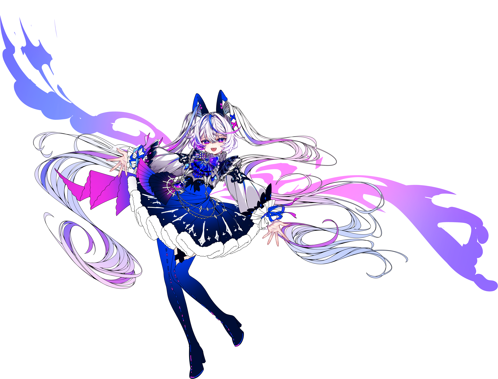

# 🎵 NEON STRIKE — Multiplayer 3-Lane Rhythm Game



## 📖 게임 개요 (Game Overview)

**NEON STRIKE**는 웹 브라우저에서 별도의 설치 없이 즉시 즐길 수 있는 **실시간 멀티플레이어 3레인 리듬 게임**입니다.
플레이어는 떨어지는 네온 노트에 맞춰 타이밍에 맞게 키(A, S, D)를 입력하거나 화면을 터치하여 점수를 획득하며, 콤보를 쌓아 'FEVER MODE'를 발동시켜 고득점을 노릴 수 있습니다. 싱글 플레이로 실력을 갈고닦은 뒤, 로비 시스템을 통해 친구들을 초대하여 실시간으로 N인 랭킹 배틀을 즐길 수 있도록 설계되었습니다.

---

## ✨ 핵심 강점 (Key Strengths)

### 1. 🌐 뛰어난 접근성과 크로스 플랫폼 지원

- **Zero-Install:** 클라이언트 설치 없이 URL 접속만으로 데스크톱, 태블릿, 모바일 기기 어디서든 즉시 플레이가 가능합니다.
- **Touch & Keyboard 호환:** 모바일 환경의 터치 인터페이스와 PC 환경의 키보드(A, S, D) 입력을 완벽하게 동시 지원합니다.

### 2. ⚡ 정밀한 오디오-노트 동기화 (Web Audio API)

- 리듬 게임의 핵심인 '싱크'를 맞추기 위해 HTML5 `AudioContext`를 활용하여 밀리초(ms) 단위의 정밀한 오디오 타이머를 구축했습니다.
- 다양한 기기와 브라우저 환경에서 발생할 수 있는 오디오 지연 및 자동 재생 차단(Auto-play Policy) 문제를 극대화된 방어적 프로그래밍(Unlock Audio)으로 해결했습니다.

### 3. 👥 완성도 높은 실시간 로비 및 N인 멀티플레이 시스템

- **Room Code 기반 매칭:** 방장이 4자리 난수 코드를 생성하고, 게스트가 코드를 입력하여 입장하는 직관적이고 깔끔한 매칭 시스템을 구현했습니다.
- **상태 동기화 (Ready/Start):** 모든 플레이어의 'Ready' 상태를 실시간으로 추적하며, 완벽한 동시 시작(Sync Start)을 위해 서버가 카운트다운 타이머를 제어합니다.
- **실시간 스코어보드:** 게임 진행 중 N명의 플레이어 점수와 콤보가 화면 우측 상단의 스코어보드에 실시간으로 브로드캐스팅되어 경쟁의 재미를 극대화합니다.

---

## 💰 비즈니스 모델 (Business Model)

NEON STRIKE는 라이브 서비스 확장 시 다음과 같은 부분 유료화(Freemium) 및 지속 가능한 수익 창출 구조를 추구합니다.

1.  **Music Pack (프리미엄 음원 판매)**
    - 기본 무료 트랙(EDM, 팝 등)을 제공하고, 유명 아티스트와의 콜라보레이션 음원이나 고난이도 하드코어 트랙을 묶은 '프리미엄 뮤직 팩'을 인앱 결제로 판매합니다.
2.  **Customization (스킨 & 테마 꾸미기)**
    - 노트의 이펙트, 타격음, 플레이 배경(Background Art), UI 테마 등을 플레이어의 취향에 맞게 변경할 수 있는 치장용(Cosmetic) 아이템을 판매합니다.
3.  **Neon Pass (시즌 배틀 패스)**
    - 멀티플레이어 대전을 통해 경험치를 쌓고 티어를 올리는 시즌제 시스템을 도입합니다. 무료 보상과 프리미엄(유료) 패스 보상을 분리하여 꾸준한 플레이와 결제를 유도합니다.
4.  **Ad-Supported Free Play (광고 기반 무료 플레이)**
    - 무과금 유저도 짧은 동영상 광고 시청 후 특정 유료 곡을 1회 플레이할 수 있게 하거나, 게임 오버 시 부활(Continue)할 수 있는 기회를 제공하여 트래픽 기반 수익을 창출합니다.

---

## 🛠 기술 스택 (Tech Stack)

- **Frontend:** HTML5 Canvas API, CSS3, Vanilla JavaScript (ES6+), Web Audio API
- **Backend:** Node.js, Express
- **Real-time Communication:** Socket.io
- **Asset Management:** CSS Grid/Flexbox 기반 반응형 UI 적용

---

## 🚀 설치 및 실행 방법 (Getting Started)

프로젝트를 로컬 환경에서 실행하려면 Node.js가 설치되어 있어야 합니다.

1. **저장소 클론 (Clone Repository)**

    ```bash
    git clone [레포지토리 URL]
    cd neon-strike
    ```

2. **종속성 패키지 설치 (Install Dependencies)**

    ```bash
    npm install
    ```

3. **게임 서버 실행 (Run Server)**

    ```bash
    npm start
    # 또는 node server.js
    ```

4. **게임 접속 (Play)**
    - 인터넷 브라우저를 열고 http://localhost:3000에 접속합니다.
    - 로컬 네트워크 멀티플레이 테스트 시, 다른 기기에서 http://[서버PC의_내부IP]:3000으로 접속하여 즐길 수 있습니다.
